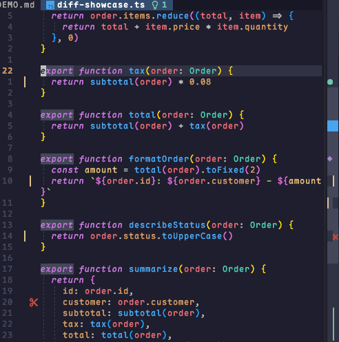

<div align="center">

<h1>vv-scrollbar.nvim</h1>

<a href="./README.md">English</a> | 中文



想要我的 Neovim 配置？查看 <a href="https://github.com/beixiyo/dotfiles">dotfiles</a>

  <em>Neovim 自绘滚动条 — 完整轨道、点击跳转、原生拖拽与代码状态标记</em>

<br />

  
  
  
</div>

---

## 依赖

- [vv-utils.nvim](https://github.com/beixiyo/vv-utils.nvim) — 必须，提供滚动、Git、高亮与计时器等共享能力
- [Git](https://github.com/git/git) — 可选，仅 staged / unstaged 标记轨道需要

## 特性

- 完整窗口高度的背景轨道，以及按可见内容比例计算的 thumb
- 点击轨道直接跳转；拖动 thumb 时保留鼠标抓取位置
- 普通点击不触发拖拽色，实际移动后才显示 hover 状态
- 与 `vv-utils.scroll` 协作，滚动条交互不会被自动平滑滚动拉回旧位置
- 使用真实分栏预留宽度，不会覆盖父窗口的行末文本
- 宽度可配置，轨道与 thumb 会占满实际宽度，默认 `2` 格
- Neovim 会在父窗口与滚动条分栏之间保留 `1` 格窗口分隔列
- 当前光标标记占满滚动条宽度，Git 使用双轨，其余 marker 保持单字符显示
- 支持多窗口，也可只显示当前窗口
- 内置 diagnostics、Git diff、搜索、Vim marks、quickfix / loclist、光标位置标记
- 自动响应滚动、窗口切换、尺寸变化、文本修改、诊断变化和 Git 状态变化
- 纯 Lua 实现，UI 与异步基础能力统一复用 `vv-utils.nvim`

## Git 双轨规则

普通文件窗口的两格轨道分别承载两套 Git 状态：左格表示 `HEAD → Index` 的
**staged** 改动，右格表示 `Index → Worktree` 的 **unstaged** 改动。同一行暂存后
再次修改时两格可以同时染色，不通过优先级互相覆盖。staged marker 会先从 Index 行号
映射到当前 Worktree buffer；`vv-git` 的 staged scratch buffer 仍只使用左格

## 安装

```lua
{
  'beixiyo/vv-scrollbar.nvim',
  dependencies = { 'beixiyo/vv-utils.nvim' },
  event = { 'BufReadPost', 'BufNewFile' },
  ---@type VVScrollbarConfig
  opts = {},
}
```

需要 Neovim `0.11+`。滚动条是一个 `style = 'minimal'` 的分屏窗口；鼠标交互完全由
`vim.on_key()` 拦截 `<LeftMouse>`/`<LeftDrag>`/`<LeftRelease>`，再用 `getmousepos()`
的屏幕坐标命中滚动条实现

## 完整配置

```lua
require('vv-scrollbar').setup({
  enabled = true,
  current_only = false,
  width = 2,
  right_offset = 0,
  min_thumb = 2,
  throttle_ms = 30,
  search_line_limit = 20000,
  window_filter = nil,

  excluded_filetypes = {
    'terminal', 'toggleterm', 'blink-cmp-menu', 'cmp_docs', 'cmp_menu',
    'dropbar_menu', 'dropbar_menu_fzf', 'DressingInput', 'noice',
    'prompt', 'TelescopePrompt', 'dashboard', 'vv-explorer', 'vv-git',
    'vv-task-panel',
  },
  excluded_buftypes = { 'nofile', 'terminal', 'prompt', 'quickfix' },

  markers = {
    diagnostics = true,
    git = true,
    search = true,
    marks = true,
    quickfix = true,
    cursor = true,
  },

  symbols = {
    thumb = ' ',
    cursor = '█',
    search = '•',
    mark = '◆',
    quickfix = '■',
    diagnostics = {
      [vim.diagnostic.severity.ERROR] = '●',
      [vim.diagnostic.severity.WARN] = '●',
      [vim.diagnostic.severity.INFO] = '●',
      [vim.diagnostic.severity.HINT] = '●',
    },
    git = {
      A = '▎',
      C = '▎',
      D = '󰆐',
    },
  },

  highlights = {
    track = { bg = '#20242b' },
    thumb = { bg = '#3b4252' },
    hover = { bg = '#4b5568' },
    cursor = { fg = '#7aa2f7' },
    search = { fg = '#ff9e64' },
    mark = { fg = '#bb9af7' },
    quickfix = { fg = '#e0af68' },
    diag_error = { fg = '#f7768e' },
    diag_warn = { fg = '#e0af68' },
    diag_info = { fg = '#7dcfff' },
    diag_hint = { fg = '#1abc9c' },
  },
})
```

`setup()` 每次都从默认配置重新合并传入值，不会继承上一次调用中未再次提供的字段

## 基础配置

| 选项 | 类型 | 默认值 | 说明 |
|------|------|--------|------|
| `enabled` | `boolean` | `true` | `setup()` 后是否立即启用 |
| `current_only` | `boolean` | `false` | 只为当前窗口显示滚动条 |
| `width` | `integer` | `2` | 轨道宽度，单位为屏幕格；最小值为 `1` |
| `right_offset` | `integer` | `0` | 距父窗口右边缘的偏移格数；最小值为 `0` |
| `min_thumb` | `integer` | `2` | thumb 最小高度；最小值为 `1` |
| `throttle_ms` | `integer` | `30` | 非鼠标直接交互的刷新节流时间；`0` 表示不延迟 |
| `search_line_limit` | `integer` | `20000` | 超过该行数时跳过搜索结果投影 |
| `excluded_filetypes` | `string[]` | 见完整配置 | 不显示滚动条的 filetype |
| `excluded_buftypes` | `string[]` | 见完整配置 | 不显示滚动条的 buftype |
| `window_filter` | `fun(win, buf): boolean` | `nil` | 返回 `false` 时不为该窗口显示滚动条 |

当窗口比配置宽度更窄时，实际宽度会自动收缩，避免浮窗越过父窗口

### 窗口级控制

插件或临时窗口可以通过窗口变量关闭自己的滚动条：

```lua
vim.w[win].vv_scrollbar_disabled = true
```

恢复时将变量设为 `nil` 或 `false`，再执行 `:VVScrollbarRefresh`。`vv-git.nvim`
会自动为左侧基准 diff 窗口设置该变量，仅保留右侧工作区的滚动条

需要把滚动条作为 marker 轨道常驻时，可设置：

```lua
vim.w[win].vv_scrollbar_always_show = true
```

`vv-git.nvim` 会为右侧 diff 窗口自动设置，避免折叠、换行或 diff filler 导致轨道
随滚动位置出现或消失

## Marker 配置

| 选项 | 默认值 | 数据来源 |
|------|--------|----------|
| `markers.diagnostics` | `true` | `vim.diagnostic.get()`，同一投影行优先显示最高严重级别 |
| `markers.git` | `true` | 普通文件通过 `diff_line_sets()` 显示 staged / unstaged 双轨；支持 `vv-git` scratch buffer |
| `markers.search` | `true` | 当前 `/` 寄存器匹配结果 |
| `markers.marks` | `true` | 当前 buffer 与全局的字母 mark |
| `markers.quickfix` | `true` | quickfix 与当前窗口 loclist |
| `markers.cursor` | `true` | 当前活动窗口的光标行，横向占满滚动条宽度 |

同一投影行出现多个 marker 时按优先级只显示一个：光标 > 诊断 > Git >
quickfix / loclist > mark > 搜索

## 符号配置

| 选项 | 默认值 | 说明 |
|------|--------|------|
| `symbols.thumb` | `' '` | thumb 填充字符，会重复填满滚动条宽度 |
| `symbols.cursor` | `'█'` | 当前光标标记，会重复填满滚动条宽度 |
| `symbols.search` | `'•'` | 搜索命中标记 |
| `symbols.mark` | `'◆'` | Vim mark 标记 |
| `symbols.quickfix` | `'■'` | quickfix / loclist 标记 |
| `symbols.diagnostics` | 四种 severity 映射 | 诊断标记字符 |
| `symbols.git` | `{ A, C, D }` | Git 新增、修改、删除标记字符 |

每个符号只读取第一个字符。除 thumb 和 cursor 外，其余 marker 不会横向重复

## 高亮配置

| 配置项 | 注册的高亮组 | 用途 |
|--------|--------------|------|
| `highlights.track` | `VVScrollbarTrack` | 背景轨道 |
| `highlights.thumb` | `VVScrollbarThumb` | 当前可见范围 |
| `highlights.hover` | `VVScrollbarHover` | 实际拖拽中的 thumb |
| `highlights.cursor` | `VVScrollbarCursor` | 当前光标位置 |
| `highlights.search` | `VVScrollbarSearch` | 搜索命中 |
| `highlights.mark` | `VVScrollbarMark` | Vim mark |
| `highlights.quickfix` | `VVScrollbarQuickfix` | quickfix / loclist |
| `highlights.diag_error` | `VVScrollbarDiagnosticError` | Error 诊断 |
| `highlights.diag_warn` | `VVScrollbarDiagnosticWarn` | Warn 诊断 |
| `highlights.diag_info` | `VVScrollbarDiagnosticInfo` | Info 诊断 |
| `highlights.diag_hint` | `VVScrollbarDiagnosticHint` | Hint 诊断 |

Git marker 使用 `vv-utils.git.register_hl()` 提供的 `VVGitAdded`、
`VVGitModified`、`VVGitDeleted`。所有高亮会在 `ColorScheme` 后重新注册

## 鼠标交互

| 操作 | 行为 |
|------|------|
| 点击轨道 | 以点击点为中心放置 thumb，并立即跳转对应视口 |
| 按下 thumb | 保持原位置，不切换 hover 色 |
| 拖动 thumb | 保留按下时的抓取偏移，并实时更新视口 |
| 拖出轨道顶部或底部 | 吸附到文件开头或结尾 |
| 松开鼠标 | 结束拖拽并恢复普通 thumb 高亮 |

滚动条跳转和拖拽使用 `vv-utils.scroll.with_auto_suppressed()`，因此即使启用了
`vv-utils.scroll` 的自动跳转动画，也不会出现先跳到目标、回到旧位置、再动画到目标的回弹

## 命令

| 命令 | 说明 |
|------|------|
| `:VVScrollbarEnable` | 启用滚动条 |
| `:VVScrollbarDisable` | 禁用滚动条并关闭所有滚动条浮窗 |
| `:VVScrollbarToggle` | 切换启用状态 |
| `:VVScrollbarRefresh` | 重新获取可见文件的 Git marker 并立即刷新 |

## Lua API

```lua
local scrollbar = require('vv-scrollbar')

scrollbar.setup({ width = 2 })
scrollbar.enable()
scrollbar.disable()
scrollbar.toggle()

local current_config = scrollbar.get_config()
```

`get_config()` 返回深拷贝，修改返回值不会影响插件内部配置

## 模块结构

```text
lua/vv-scrollbar/
├── core/        几何计算、运行状态与浮窗渲染
├── features/    Git 数据和 marker 收集
├── input/       鼠标 press / drag / release 状态机
├── lifecycle/   autocmd 生命周期
├── ui/          高亮注册
├── config.lua   默认配置与合并
└── init.lua     对外生命周期 API
```

## 测试

```bash
nvim --headless -u NONE -l tests/test_smoke.lua
```
